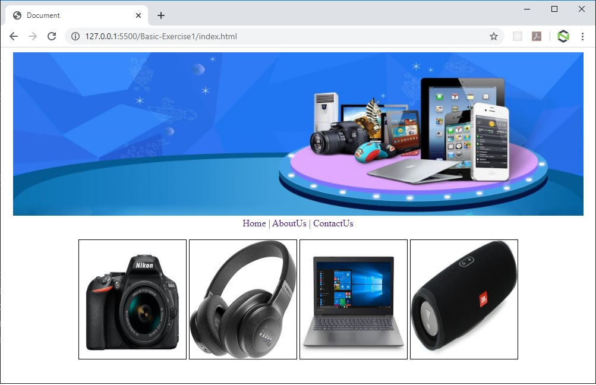
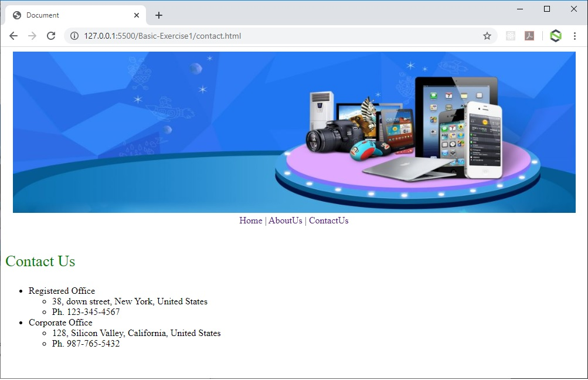

## PRMC1 - HTML5 & CSS3

### Basic Exercise-1

### Concepts Covered
- What is CSS?, What we can do with CSS, Advantages of using CSS, CSS Syntax, CSS Comments, Including CSS in HTML Documents(Inline styles, Embedded styles, External style sheets)
- Overview, New features in HTML5,Browser support, Backward compatibility
- DOCTYPE, Character Encoding, link, HTML5 Elements, HTML5 Attributes(Standard, Custom), HTML5 Document

### Problem Statement
Create HTML website of an online electronics store with below mentioned requirements
- You should have 3 pages in your website `index.html`, `contact.html` & `about.html`.
- In all 3 pages you should have a banner image on the top with the size of `960px` X `275px`. The banner image should have a border of `1px` and aligned to center of the page. Use external stylesheet to reuse the same style across all the web pages.
- Below the banner image, in all 3 pages you should have hyperlinks like - `Home`, `AboutUs`, `ContactUs` to navigate from one page to another. Remove the underline from the hyperlinks using CSS.
- On `index.html` page display 4 product images in the same row with the size of `180px` X `200px` alongwith a solid black border of `1px`. Use embedded stylesheet to reuse the style across all the images.
- In `contact.html` display the contact details of different offices of the store in bulleted list as mentioned below
    - Registered Office
        - 38, down street, New York, United States
        - Ph. 123-345-4567
    - Corporate Office
        - 128, Silicon Valley, California, United States
        - Ph. 987-765-5432
- In addition display the heading as `Contact Us` in green color with font size `20pt`. Use inline stylesheet to achieve the same.
- In `about.html` page display the heading as `About Us` in grey color with font size `20pt`. Use inline stylesheet to achieve the same. Also write some text in paragraph.

- The home page should appear as shown in the following figure.

- The About page should appear as shown in the following figure.

- The Contact page should appear as shown in the following figure.

