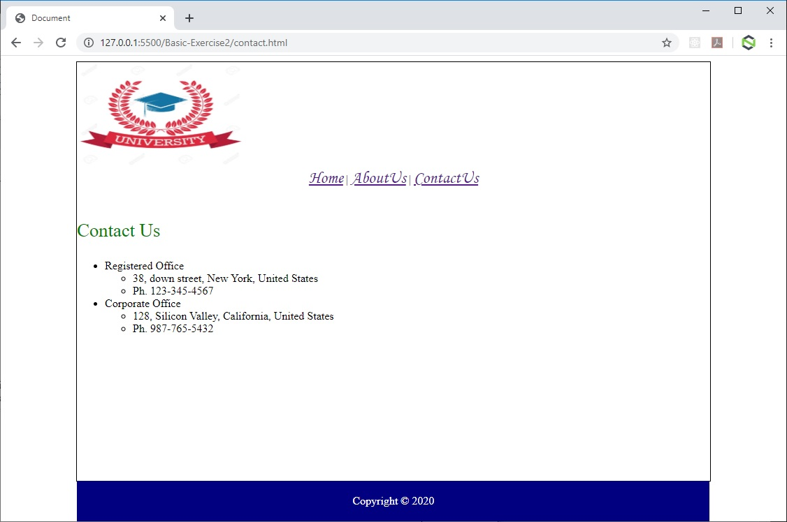

## PRMC1 - HTML5 & CSS3

### Basic Exercise-2

### Concepts Covered
- What is CSS?, What we can do with CSS, Advantages of using CSS, CSS Syntax, CSS Comments, Including CSS in HTML Documents(Inline styles, Embedded styles, External style sheets)
- Overview, New features in HTML5,Browser support, Backward compatibility
- DOCTYPE, Character Encoding, link, HTML5 Elements, HTML5 Attributes(Standard, Custom), HTML5 Document

### Problem Statement
Create HTML website of college with below mentioned requirements
- You should have 3 pages in your website `index.html`, `contact.html` & `about.html`. Content of all the pages should be inside a container with border of `1px` & should have a margin of `100px` from both the sides (left & right).
- In all 3 pages you should have an image (logo of college) on the top left corner with the size of `240px` X `150px`. Use external stylesheet to reuse the same style across all the web pages.
- Add a footer on all the pages which should be displayed at the bottom of the page irrespective the length of the content.
- Below the logo image, in all 3 pages you should have hyperlinks like - `Home`, `AboutUs`, `ContactUs` to navigate from one page to another. Change the font to `Monotype Corsiva` and font size to `18pt`.
- On `index.html` page display heading as `Our College Campus` and 4 campus images (take any relevant images from internet) in the same row with the size of `210px` X `160px` alongwith a solid blue border of `1px`. Use embedded stylesheet to reuse the style across all the images. The corners of the images should be rounded.
- Below the images
- In `contact.html` display the contact details of different offices of the store in bulleted list as mentioned below
    - College Address
        - 38, Down Street, New York, United States
        - Ph. 123-345-4567
    - Headquarter Address
        - 128, Silicon Valley, California, United States
        - Ph. 987-765-5432
- In addition display the heading as `Contact Us` in green color with font size `10pt`. Use inline stylesheet to achieve the same.
- In `about.html` page display the heading as `About Us` in grey color with font size `10pt`. Use inline stylesheet to achieve the same. Also write some text in paragraph.

- The home page should appear as shown in the following figure.

- The About page should appear as shown in the following figure.

- The Contact page should appear as shown in the following figure.

