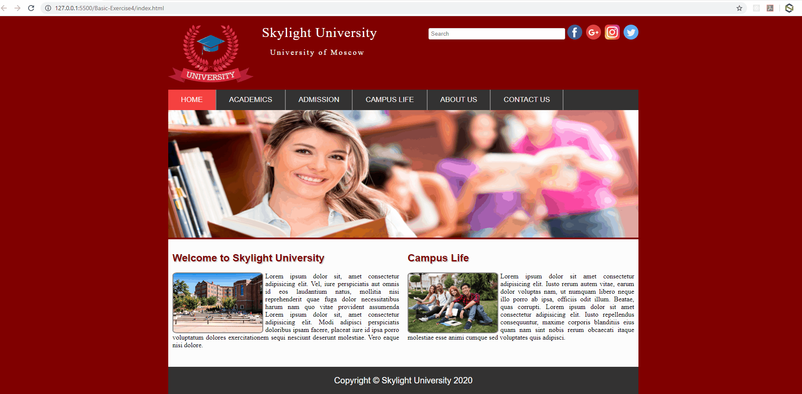

## PRMC1 - HTML5 & CSS3

### Basic Exercise-4

### Concepts Covered
- Universal Selector, Element Type Selector, Id Selectors, Class Selectors, Descendant Selectors, Child Selectors, Adjacent Sibling Selectors, General Sibling Selectors, Grouping Selectors, Attribute Selector,  CSS Color, CSS Background, CSS Fonts, CSS Text, CSS Links, CSS Lists, CSS Tables
- CSS Box Model, Margin, padding, border, Outline, Visibility vs. Display

### Problem Statement
Create an HTML page of Skylight University as per the below requirements
- Add a dark background color to the page.
- Add a header on the top. Header should contain the logo image of university, Search field and social media icons.
    - Header text `Skylight University` & `University of Moscow` should have the space of 1px betwen the letters.
    - Search textfield should have rounded corners
    - All social media icons should be in round shape.
- Below the header add a navigation bar to add links. It should have Home, Academics, Admission, Campus Life, About Us & Contact Us links.
    - Add a hover effect in all the links and change the backgound color on mouse hover.
- Below the navigation bar add a banner image.
- After the image divide the area in two sections. In left section add intro text of university along with the image and in right section add text about campus life of university with image. The corners of the image should be rounded.
- At the bottom add a footer with copyright information.
- Finally the page should look like below mentioned.

